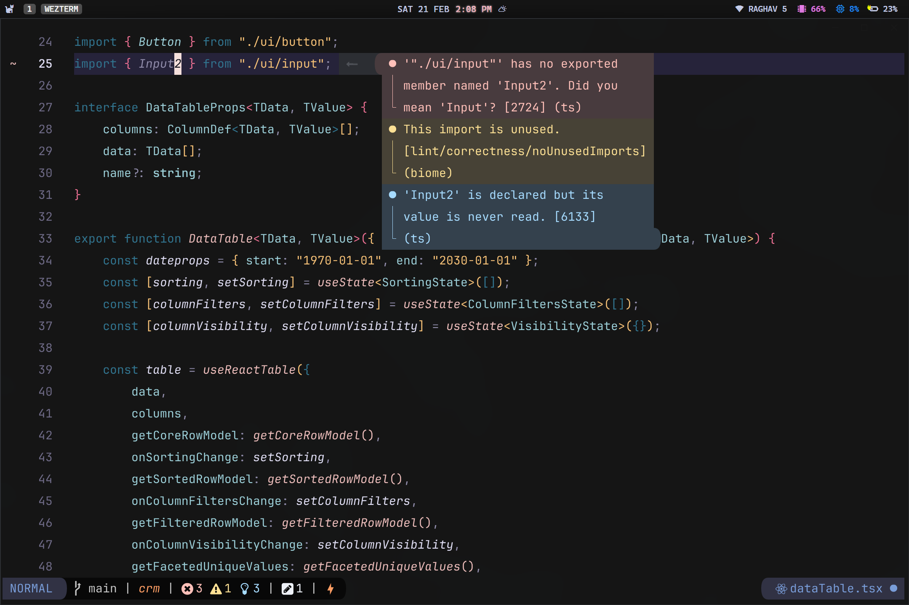
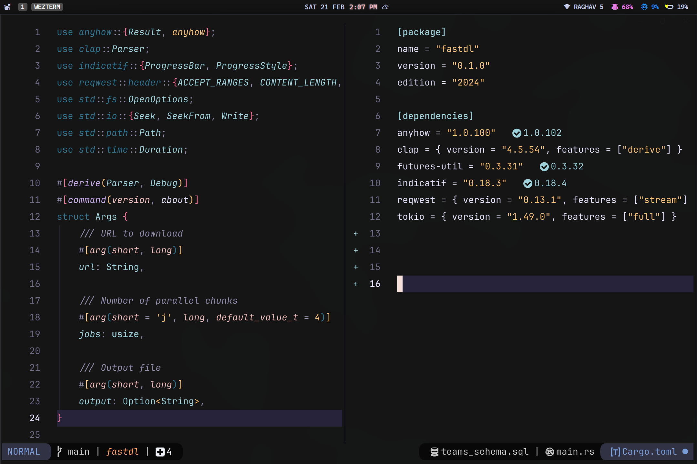

# Neovim Configuration

A fast, minimal, and modern Neovim setup focused on productivity and clean workflow.

## ✨ Features

* ⚡ Fast startup and responsive editing
* 🧠 LSP with diagnostics and autocompletion
* 🎨 Consistent UI and theme
* 🔍 Fuzzy finding & navigation
* 🧰 Git integration and tooling
* 🪶 Minimal and distraction-free layout

## 🖼 Preview

## 📦 Plugins & Tooling

* LSP & completion
* Treesitter
* Telescope
* Git integrations
* Formatting & linting

## 🎯 Goals

* Keep it minimal
* Stay fast
* Reduce friction
* Improve focus

---

Feel free to explore and adapt it to your workflow.
